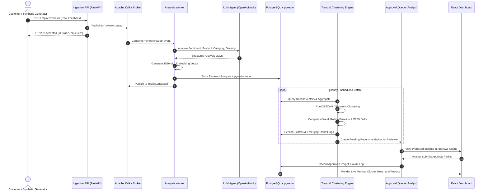

# Customer Voice AI — System Architecture Specification

## 1. Executive Summary

**Customer Voice AI** is an enterprise-grade, event-driven Customer Voice Intelligence Platform designed for financial services (demonstrated using the fictional institution **Acme Financial**).

The platform transforms high-volume, unstructured customer feedback into prioritized, evidence-backed operational insights:
```
Raw Review → AI Analysis → Vector Embedding → Semantic Clustering → Trend & Velocity Detection → Root-Cause Investigation → Team Routing → Human-in-the-Loop Review → Executive Intelligence Report
```

---

## 2. High-Level Architecture Diagram

```mermaid
flowchart TD
    subgraph Sources["Customer Voice Ingestion Sources"]
        S1["Google Reviews"]
        S2["App Store / Play Store"]
        S3["Yelp Reviews"]
        S4["Internal Customer Surveys"]
        S5["Synthetic Review Generator"]
    end

    subgraph Ingestion["Ingestion Layer & Broker"]
        API["FastAPI Ingestion Endpoint\nPOST /api/v1/reviews"]
        PROD["Kafka Event Producer"]
        K1["Kafka Topic:\nreview.created"]
    end

    subgraph StreamWorkers["Asynchronous Workers"]
        CONS1["Review Processing Consumer"]
        LLM_AGENT["Review Analysis Agent\n(Structured Extraction)"]
        EMBED_AGENT["Embedding Generator\n(1536-dim Vectors)"]
        K2["Kafka Topic:\nreview.analyzed"]
    end

    subgraph Persistence["Storage & Vector Search"]
        PG[("PostgreSQL 16")]
        VEC[("pgvector\nCosine / HNSW Index")]
    end

    subgraph AnalyticalEngines["Analytics & Intelligence Engines"]
        CLUST["Semantic Clustering Engine\n(DBSCAN / HDBSCAN)"]
        TREND["Trend & Velocity Detector\n(4-Week Baseline vs WoW Change)"]
        INVEST["Root Cause / Investigation Agent\n(Evidence vs Hypothesis Separation)"]
        ROUTE["Configurable Team Routing Engine\n(Rules & DB Mapping)"]
    end

    subgraph HITL["Human-in-the-Loop Workflow"]
        QUEUE["Pending Recommendations Queue"]
        REVIEWER{"Domain Reviewer / Analyst\n(Approve / Reject / Edit)"}
        AUDIT[("Audit Log & Decisions")]
    end

    subgraph Delivery["Delivery & Presentation"]
        SCHED["Scheduled Weekly Intelligence Reporter"]
        REP_STORE[("Weekly Reports DB")]
        DASHBOARD["React 18 + Vite + Tailwind Dashboard"]
    end

    Sources --> API
    API --> PROD
    PROD --> K1
    K1 --> CONS1
    CONS1 --> LLM_AGENT
    LLM_AGENT --> EMBED_AGENT
    EMBED_AGENT --> K2
    K2 --> PG
    EMBED_AGENT --> VEC

    PG & VEC --> CLUST
    CLUST --> TREND
    TREND --> INVEST
    INVEST --> ROUTE
    ROUTE --> QUEUE

    QUEUE --> REVIEWER
    REVIEWER --> AUDIT
    AUDIT --> SCHED
    SCHED --> REP_STORE
    REP_STORE & PG --> DASHBOARD
```



---

## 3. Core Component Descriptions

### 3.1 Review Ingestion Layer
* Ingests feedback from multi-channel sources (App Store, Play Store, Google, Yelp, Internal).
* Assigns unique UUIDs, source metadata, timestamps, and customer identifiers.
* Publishes to `review.created` Kafka topic asynchronously with low latency.

### 3.2 Review Analysis Agent
* Evaluates raw text and extracts structured JSON:
  * Sentiment (`positive`, `neutral`, `negative`)
  * Sentiment Score (float from `-1.0` to `+1.0`)
  * Product (`Mobile Banking`, `Credit Cards`, `ATMs`, `Branch Operations`, `Rewards`, etc.)
  * Category (`authentication`, `transaction_failure`, `fee_dispute`, `ui_ux`, etc.)
  * Specific Issue (`session_expiration`, `biometric_login_failure`, `statement_error`, etc.)
  * Severity (`critical`, `high`, `medium`, `low`)
  * Customer Intent (`complete_payment`, `inquire_balance`, `dispute_charge`, etc.)
  * Confidence Score (`0.0` to `1.0`)
* Strictly validated via Pydantic schemas.

### 3.3 Vector Embeddings & pgvector Storage
* Converts review semantics into dense 1536-dimensional embeddings.
* Persisted in PostgreSQL using the `pgvector` extension.
* Indexed using HNSW (Hierarchical Navigable Small World) for sub-millisecond approximate nearest neighbor (ANN) cosine similarity search.

### 3.4 Semantic Clustering Engine
* Periodically groups semantically coherent complaints regardless of superficial phrasing differences.
* Computes cluster centroids, member cardinality, sentiment distributions, and representative reviews.

### 3.5 Trend & Velocity Detection Engine
* Calculates statistical metrics comparing current periods against a 4-week rolling baseline:
  * Absolute volume & negative percentage
  * Week-over-Week (WoW) percentage change
  * Trend direction (`emerging`, `stable`, `improving`)
  * Anomaly z-score
* Flags sudden surges (e.g. `+43%` week-over-week authentication complaints) as emerging issues.

### 3.6 Root Cause & Investigation Agent
* Synthesizes cluster members and generates structured operational hypotheses.
* **Non-Negotiable Principle:** Hard separation between **Observed Evidence** ("Customers report biometric timeout on iOS v4.2") and **Hypothesis** ("Authentication backend changes may warrant investigation"). Never states unverified guesses as confirmed facts.

### 3.7 Team Routing Engine
* Configurable database-backed routing table.
* Dynamically routes issues to generic enterprise teams:
  * Authentication / App Bugs $\rightarrow$ **Digital Engineering**
  * Wire / Card Processing $\rightarrow$ **Payments Operations**
  * Points / Cashback disputes $\rightarrow$ **Rewards Product Team**
  * Teller / Branch physical experience $\rightarrow$ **Branch Operations**
  * Support wait times / agent demeanor $\rightarrow$ **Customer Experience**

### 3.8 Human-in-the-Loop (HITL) Approval Workflow
* AI insights are queued for human review.
* Analysts can Approve, Reject, or Edit proposed recommendations and add commentary.
* Establishes a verifiable audit trail for enterprise governance.

### 3.9 Weekly Intelligence Reporter
* Scheduled aggregation engine generating comprehensive executive briefs:
  * Executive Summary & overall sentiment trajectory
  * Top Emerging Issues (with review count, trend %, representative quotes, suggested actions)
  * Improving Issues (areas of successful resolution)
  * Geographic anomaly breakdowns

### 3.10 Modern React Dashboard
* Responsive single-page application built with React, Vite, TypeScript, Tailwind CSS, and Recharts.
* Real-time metrics, cluster explorers, review search filters, trend charts, and the approval queue.

---

## 4. End-to-End Data Flow



---

## 5. Technology Stack Rationale

| Layer | Technology | Rationale |
|---|---|---|
| **API Backend** | Python 3.10+ & FastAPI | High-performance asynchronous runtime, native Pydantic schema validation, automatic OpenAPI / Swagger generation. |
| **Relational & Vector DB** | PostgreSQL 16 + pgvector | Eliminates duplicate database infrastructure by combining ACID transactional data, relational foreign keys, and high-performance vector search in a single engine. |
| **Event Streaming** | Apache Kafka (KRaft mode) | Enterprise standard for distributed, durable, decoupled event streaming; provides at-least-once delivery and consumer scaling. |
| **AI Extraction & Reasoning** | Pydantic + LLM Agents (OpenAI/Local) | Guaranteed structured JSON schemas, strict validation, deterministic output enforcement, zero-shot entity extraction. |
| **Embeddings & Similarity** | 1536-dimensional Cosine Embeddings | Captures subtle semantic nuance across varied customer vernacular ("WiFi cuts out" vs "Cafe internet dropped"). |
| **Clustering & Trend Math** | Scikit-learn, NumPy, Pandas | Battle-tested numerical stability, deterministic statistical baselines, and parameterizable clustering algorithms. |
| **Frontend UI** | React 18, TypeScript, Tailwind CSS, Vite | Type-safe, component-driven, lightning-fast HMR dev experience, clean modular enterprise styling. |
| **Infrastructure** | Docker, Docker Compose, Kubernetes | Portable containerized workloads matching 12-factor cloud standards for AWS/GCP deployments. |
