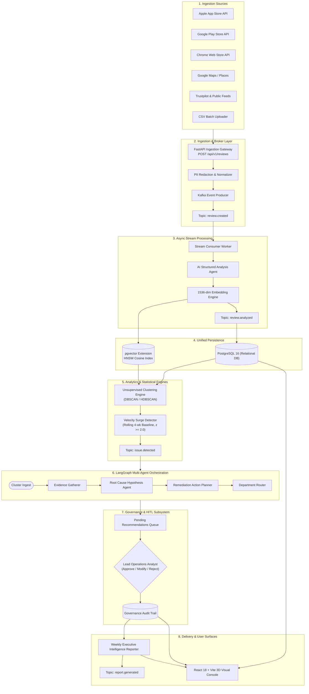
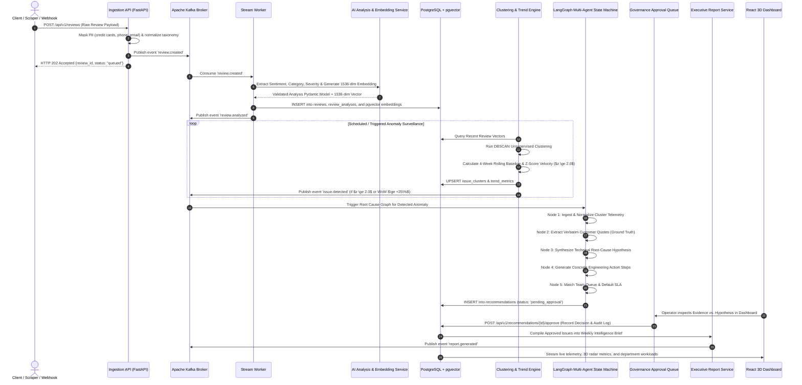

# VoiceIQ — Technical System Architecture Specification

> **Document Version:** 1.1.0  
> **Status:** Active / Production-Ready  
> **Audience:** Software Engineers, System Architects, DevOps, Technical Leads  

---

## 1. System Overview & Technical Objectives

**VoiceIQ** is an enterprise-grade, event-driven customer voice intelligence and remediation platform. It ingests high-volume, unstructured multi-channel customer reviews, performs structured AI extraction, clusters semantically similar issues using dense vector embeddings, detects volume velocity surges via statistical baseline comparisons, runs multi-agent root-cause investigations, deterministically routes issues to department queues, and enforces human-in-the-loop governance.

### Core Non-Functional Requirements
- **High Ingestion Throughput:** Asynchronous non-blocking review ingestion decoupled via Apache Kafka.
- **Low Latency Semantic Search:** Sub-millisecond approximate nearest neighbor (ANN) vector retrieval via PostgreSQL `pgvector` with HNSW indexing.
- **Resilience & Local Autonomy:** Transparent fallback to in-memory asynchronous queues when external Kafka brokers are unavailable, enabling offline development and fast CI/CD runs.
- **Responsible AI Compliance:** Hard boundary separating ground-truth customer evidence from unverified engineering hypotheses.
- **Auditability:** Complete decision lineage for every AI recommendation approved, modified, or rejected by human operators.

---

## 2. High-Level Architecture Topology



---

## 3. End-to-End Execution Flow (Sequence Diagram)



---

## 4. Component Subsystem Specifications

### 4.1 Ingestion & Normalization Subsystem
* **Service:** [`IngestionService`](file:///Users/saurabhjadhav5172gmail.com/Workspace/AI/Customer-Voice-AI/backend/app/services/ingestion_service.py)
* **Taxonomy Normalization:** Uses exact and fuzzy regex matching to resolve colloquial user phrasing to canonical product IDs (`c1_mobile_ios`, `venture_x`, `c1_cafe`, `c1_360_checking`, `shopping_extension`).
* **PII Redaction Pipeline:**
  - Credit Card Numbers: Luhn-validated 13-16 digit sequences replaced with `[REDACTED_CARD]`.
  - Phone Numbers: US/International telephone patterns replaced with `[REDACTED_PHONE]`.
  - Email Addresses: Standard RFC 5322 regex matches replaced with `[REDACTED_EMAIL]`.

### 4.2 Event Streaming & Kafka Broker
* **Service:** [`KafkaProducerService`](file:///Users/saurabhjadhav5172gmail.com/Workspace/AI/Customer-Voice-AI/backend/app/kafka/producer.py)
* **Broker Protocol:** Apache Kafka in KRaft mode (no Zookeeper dependency).
* **Guarantees:** At-least-once delivery with partition key partitioning based on `product_id` for ordered downstream processing.
* **Transparent Degradation:** When `KAFKA_BOOTSTRAP_SERVERS` is unreachable, `_fallback_queue` buffers events in-memory, enabling seamless local developer execution.

### 4.3 Structured AI Analysis Engine
* **Service:** [`AnalysisService`](file:///Users/saurabhjadhav5172gmail.com/Workspace/AI/Customer-Voice-AI/backend/app/services/analysis_service.py)
* **LLM Model:** OpenAI GPT-4o / GPT-4o-mini with deterministic fallback to `MockAnalysisAgent` in CI environments.
* **Schema Contract:** Validated through Pydantic models:
  ```python
  class ReviewAnalysisCreate(BaseModel):
      sentiment: Literal["positive", "neutral", "negative"]
      sentiment_score: float = Field(ge=-1.0, le=1.0)
      category: str
      specific_issue: str
      severity: Literal["low", "medium", "high", "critical"]
      customer_intent: str
      confidence: float = Field(ge=0.0, le=1.0)
  ```

### 4.4 Vector Embedding & Similarity Search
* **Service:** [`EmbeddingService`](file:///Users/saurabhjadhav5172gmail.com/Workspace/AI/Customer-Voice-AI/backend/app/services/embedding_service.py)
* **Vector Dimension:** 1536 floats (OpenAI `text-embedding-3-small` standard).
* **Storage & Indexing:** PostgreSQL 16 `pgvector` extension with HNSW index:
  ```sql
  CREATE INDEX idx_review_embeddings_hnsw 
  ON review_embeddings 
  USING hnsw (embedding vector_cosine_ops)
  WITH (m = 16, ef_construction = 64);
  ```

### 4.5 Unsupervised Semantic Clustering Engine
* **Service:** [`ClusteringService`](file:///Users/saurabhjadhav5172gmail.com/Workspace/AI/Customer-Voice-AI/backend/app/services/clustering_service.py)
* **Algorithm:** Density-Based Spatial Clustering of Applications with Noise (DBSCAN) using precomputed cosine distance matrices.
* **Key Properties:**
  - Discovers arbitrarily shaped clusters without requiring a pre-specified cluster count ($k$).
  - Automatically isolates outliers (`label = -1`) as transient noise.
  - Computes cluster centroids, negative sentiment ratios, and representative customer quotes.

### 4.6 Statistical Velocity Surge Anomaly Detector
* **Service:** [`TrendService`](file:///Users/saurabhjadhav5172gmail.com/Workspace/AI/Customer-Voice-AI/backend/app/services/trend_service.py)
* **Mathematical Baseline Model:**
  1. Computes rolling volume mean ($\mu$) and standard deviation ($\sigma$) over four historical 7-day windows ($W_{-4} \dots W_{-1}$).
  2. Evaluates standard score for current window ($W_0$):
     $$z = \frac{V_{\text{current}} - \mu}{\sigma + \epsilon}$$
  3. Classification Thresholds:
     - **`emerging`:** $V_{\text{current}} \ge 3$ AND ($z \ge 2.0$ OR $\text{WoW \%} \ge +25\%$).
     - **`improving`:** $V_{\text{previous}} \ge 3$ AND $\text{WoW \%} \le -25\%$.
     - **`stable`:** Steady-state baseline.

### 4.7 LangGraph Multi-Agent Root Cause State Machine
* **Service:** [`InvestigationService`](file:///Users/saurabhjadhav5172gmail.com/Workspace/AI/Customer-Voice-AI/backend/app/services/investigation_service.py)
* **Graph Architecture:**
  ```
  (Start) ──> [Ingest Telemetry] ──> [Synthesize Evidence]
                                              │
  (End)   <── [Route to Team]    <── [Generate Hypothesis & Action]
  ```
* **State Contract:** Strictly enforces schema separation between verbatim quotes (`observed_evidence`), technical theories (`investigation_hypothesis`), and concrete engineering tasks (`recommended_action`).

### 4.8 Deterministic Enterprise Team Routing Engine
* **Service:** [`RoutingEngine`](file:///Users/saurabhjadhav5172gmail.com/Workspace/AI/Customer-Voice-AI/backend/app/services/routing_engine.py)
* **Department Queues & Default SLAs:**
  - `digital_engineering_mobile` (P1 — 24h SLA)
  - `payments_operations` (P2 — 48h SLA)
  - `travel_lounges_product` (P2 — 48h SLA)
  - `cafe_operations` (P3 — 72h SLA)
  - `digital_ai_security` (P2 — 48h SLA)
  - `shopping_engineering` (P3 — 72h SLA)
  - `customer_experience` (Intelligent Fallback)

### 4.9 Governance & Human-in-the-Loop (HITL) Subsystem
* **Service:** [`HITLService`](file:///Users/saurabhjadhav5172gmail.com/Workspace/AI/Customer-Voice-AI/backend/app/services/hitl_service.py)
* **Security Principle:** Automated recommendations remain in `pending_approval` state until a human operator signs off.
* **Audit Lineage:** Every decision persists operator ID, decision type (`approved`, `rejected`, `modified`), timestamp, and modification diff.

### 4.10 Executive Intelligence Reporting Engine
* **Service:** [`ReportService`](file:///Users/saurabhjadhav5172gmail.com/Workspace/AI/Customer-Voice-AI/backend/app/services/report_service.py)
* **Outputs:** Deterministic HTML reports, publication-ready GitHub-flavored Markdown briefs, and structured JSON payloads for downstream data warehouse ingestion.

---

## 5. Security & Responsible AI Architecture

```
┌────────────────────────────────────────────────────────────────────────┐
│                        RESPONSIBLE AI BOUNDARY                         │
├───────────────────────────────────┬────────────────────────────────────┤
│     OBSERVED CUSTOMER EVIDENCE    │      INVESTIGATION HYPOTHESIS      │
│          (Ground Truth)           │         (Tentative Theory)         │
├───────────────────────────────────┼────────────────────────────────────┤
│ • Direct, unedited quotes         │ • Technical potential explanations │
│ • App store version metadata      │ • Upstream dependency checks       │
│ • Quantified complaint counts     │ • Suggested diagnostic paths       │
│ • "Customers report biometric     │ • "Investigate whether upstream    │
│    failure on iOS v6.14.0"        │    FaceID API timeout increased"   │
└───────────────────────────────────┴────────────────────────────────────┘
```

1. **Strict Evidence vs. Hypothesis Separation:** Guarantees that AI-generated hypotheses are never labeled as established software defects.
2. **PII Scrubbing at Boundary:** Eliminates customer identifiers prior to embedding or LLM evaluation.
3. **Deterministic Seed Control:** Synthetic test data generators use deterministic RNG seeds for reproducible test runs.

---

## 6. Technology Stack & Architectural Decision Records (ADRs)

| Decision Area | Selected Technology | Alternative Evaluated | Selection Rationale |
| :--- | :--- | :--- | :--- |
| **API Runtime** | **FastAPI (Python 3.10+)** | Flask / Django / Express | Asynchronous ASGI runtime, native Pydantic v2 validation, automatic OpenAPI doc generation. |
| **Persistence** | **PostgreSQL 16 + pgvector** | Pinecone / Qdrant + MongoDB | Single engine eliminates data synchronization bugs between transactional records and vector indexes. |
| **Event Broker** | **Apache Kafka (KRaft)** | RabbitMQ / AWS SQS | Replayability, durable log retention, and high-throughput partition consumer group scaling. |
| **Agent Framework**| **LangGraph** | AutoGen / CrewAI | State-machine graph formulation with deterministic transitions and native human-in-the-loop interruption. |
| **Clustering** | **Scikit-learn DBSCAN** | K-Means / Agglomerative | Unsupervised clustering without prior knowledge of $k$; isolates noise points automatically. |
| **Frontend** | **React 18 + Vite + Tailwind** | Next.js / Vue | Fast client-side SPA rendering with rapid HMR and lightweight bundle deployment. |

---

*Document maintained at `docs/architecture.md` • VoiceIQ Platform*
